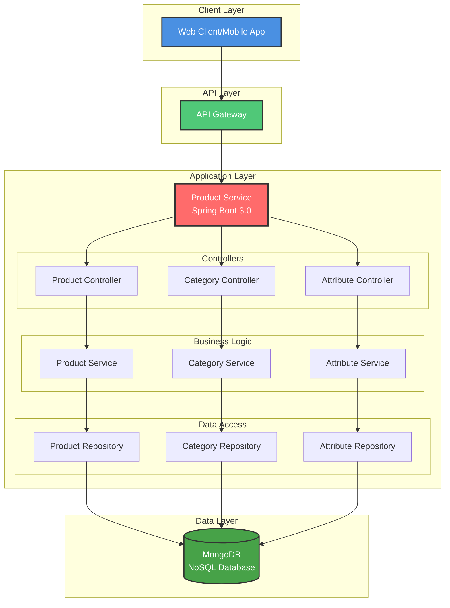
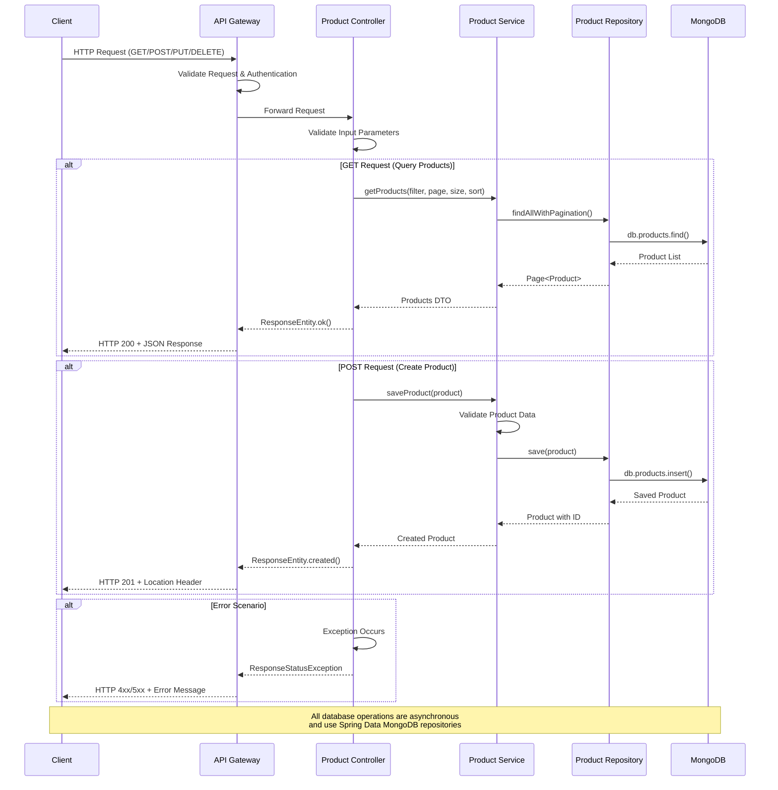

# **Product Service**

## **Description:**

A comprehensive Spring Boot microservice for managing products in an e-commerce platform. The service provides CRUD operations for products, categories, and product attributes with advanced features like pagination, sorting, and filtering.

## **Features:**

- **Product Management**: Complete CRUD operations for products
- **Category Management**: Load and manage product categories from taxonomy files
- **Product Attributes**: Manage product-specific attributes and variants
- **Advanced Search**: Fetch products with pagination, sorting, and filtering capabilities
- **RESTful API**: Well-structured REST endpoints with proper HTTP status codes
- **MongoDB Integration**: NoSQL database for flexible product data storage
- **Docker Support**: Containerized deployment with multi-stage builds
- **Spring Boot 3.0**: Built on latest Spring Boot framework with Java 17

## **Technology Stack:**

- **Framework**: Spring Boot 3.0.7
- **Language**: Java 17
- **Database**: MongoDB
- **Build Tool**: Gradle
- **Container**: Docker with multi-stage builds
- **Libraries**: Lombok, Guava, Spring Data MongoDB

## **API Endpoints:**

### Product Endpoints
- `GET /` - Health check endpoint
- `POST /product` - Create a new product
- `PUT /product/{id}` - Update an existing product
- `GET /product/{id}` - Get product by ID
- `GET /product` - Get paginated product list with filtering and sorting
- `DELETE /product/{id}` - Delete a single product
- `DELETE /product` - Delete multiple products (batch delete)

### Category Endpoints
- `GET /load` - Load categories from taxonomy file

### Query Parameters for Product Listing
- `page` (default: 0) - Page number for pagination
- `pageSize` (default: 10) - Number of items per page
- `sortField` (default: "id") - Field to sort by
- `sortOrder` (default: 0) - Sort order (0=ascending, 1=descending)
- `filter` (default: "") - Filter string for product search

## **Prerequisites:**

- Java 17 SDK installed and configured in PATH
- MongoDB instance (local or remote)
- Gradle (wrapper included)

## **Configuration:**

The application supports multiple environment profiles:
- **Development**: `application-dev.properties`
- **Production**: `application-prod.properties`
- **Local**: `application-local.properties`

Default configuration in [`application.properties`](src/main/resources/application.properties:1):
```properties
spring.profiles.active=dev
server.port=8080
```

## **Usage:**

### Local Development
Make sure you have Java 17 SDK installed in your PATH:

```shell
# Run with Gradle wrapper
./gradlew bootRun

# Or run with specific profile
./gradlew bootRun --args='--spring.profiles.active=dev'
```

### Build Application
```shell
# Build the application
./gradlew build

# Run tests
./gradlew test
```

### Docker Deployment
```shell
# Build Docker image
docker build -t product-service .

# Run container
docker run -p 8080:8080 -e SPRING_PROFILES_ACTIVE=dev product-service
```

## **Database Setup:**

The service uses MongoDB as the primary database. Ensure MongoDB is running and accessible. The connection details can be configured in the respective profile properties files.

## **System Architecture**

### **Component Architecture**


### **Request Flow Sequence Diagram**


## **Project Structure:**

```
src/
├── main/
│   ├── java/org/aztekcoder/ecommerce/productservice/
│   │   ├── controller/     # REST API controllers
│   │   ├── entity/         # Data models/entities
│   │   ├── repository/     # Data access layer
│   │   ├── service/        # Business logic
│   │   └── ProductApplication.java  # Main application class
│   └── resources/
│       ├── application*.properties  # Configuration files
│       └── taxonomy-with-ids.en-US.txt  # Category taxonomy data
└── test/                   # Unit and integration tests
```

## **Error Handling:**

The service implements comprehensive error handling with appropriate HTTP status codes:
- `200 OK` - Successful operations
- `201 Created` - Resource creation successful
- `400 Bad Request` - Invalid request data
- `404 Not Found` - Resource not found
- `500 Internal Server Error` - Server-side errors

## **Testing:**

Run the test suite using:
```shell
./gradlew test
```

The project includes unit tests for core functionality and integration tests for API endpoints.

## **Deployment:**

The application can be deployed using:
1. **Traditional deployment**: Build JAR and run with Java
2. **Docker containers**: Use provided Dockerfile for containerized deployment
3. **Cloud platforms**: Compatible with AWS ECS, Kubernetes, and other container orchestrators

## **Monitoring and Logging:**

The service includes Spring Boot Actuator endpoints for health checks and monitoring (when enabled).

